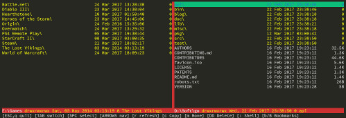

# JM

A simple, cross-platform terminal-based file manager written in Go.

## Usage
    jm [left path] [right path] [flags]

    Flags
      -c, --config string   config file (default "$HOME/.jm")

The configuration file contains the state of your last session. It is read on startup and saved when you quit.

If the paths are not given in the command line and the configuration file does not exist, `jm` defaults to your current and `$HOME` folders.

DISCLAIMER: USE `JM` AT YOUR OWN RISK. None of the authors or contributors can be held responsible for any losses or damages connected to your use of this program. We have done our best to ensure correct, predictable and safe operation, but can't offer any guarantees that it will do so for you.

The latest version of `jm` can usually be found at [https://github.com/TheJare/jm](https://github.com/TheJare/jm)

## Docs

The interface displays two side by side panels, each with the contents of a directory. You can toggle between panels with the `TAB` key. Exit with the `q` or `ESC` keys.

### Navigation

- `Up`/`Down arrows`, `Page Up`/`Page Down`, and `Home`/`End` keys let you navigate up and down the files in the current panel.
- `Left arrow` goes to the parent directory, `Right arrow` enters the directory the cursor is on.
- Alternatives for these keys are `h`, `j`, `k` & `l` for the arrows (for you `vi` lovers), `u` & `i` for PgUp/PgDn, and `y` & `p` for Home/End.
- `b` followed by a digit jumps to a bookmark. On Windows, letters refer to the system drives. `/` jumps to the root, and `~` jumps to the user's home directory.
- `B` followed by a digit saves the current path to that bookmark.
- `Space` toggles selection of the current file/folder, `a` selects all or clears the selection.

### File operations

- `c` copies the selected files/folders (or the file at the cursor if there's no selection) from the current panel to the other.
- `m` moves the selected files.
- `DD` (`Shift+d` twice) deletes the selected files.

Operations targeting the root folder are aborted for safety reasons.

### Misc

- `:` (colon) opens a shell on the folder the active panel is at.

## Notes

The shell invoked from `jm` should be considered unstable and used sparingly, due to technical reasons in the Go runtime. For example, I have found that `Ctrl-C` inside this shell is likely to kill `jm` and leave both the parent and child shells running simultaneously. There are likely other strange states lurking that I haven't caught yet.

File operations involving hidden, readonly or otherwise protected files may have corner cases I have not caught. Use with care.

`jm` works fine under normal conditions in Windows, Linux and OSX, using the default terminals as well as inside iTerm2, ConEmu, Putty, terminator, tmux, screen and even Visual Studio Code's embedded terminal.

`jm` is currently known to NOT run properly on at least the following environments:

- Inside Mintty to a Cygwin/Msys shell: no display. This is expected, as Mintty does not provide a Windows console interface to native programs
- `ssh` session from Windows using Git/Msys's `ssh`: corrupted display and no control keys. This seems a problem where termbox-go does not try to read terminal capabilities from `/lib/terminfo/`, where the cygwin database resides in Ubuntu and other Unix versions. Doing `export TERMINFO=/lib/terminfo` before running `jm` seems to let it mostly work, but some corruption remains when resizing, and the cursor is never hidden.
- Linux subsystem for Windows: crash on startup. This seems due to WSL not supporting async IO in general. Some fcntls (E_SETOWN/GETOWN) which Termbox requires to retrieve input via SIGIO will fail. Once this is solved (either in WSL or by removing SIGIO from Termbox), the above TERMINFO issues may apply as well.

## Technical

`jm` is written in [Go](https://golang.org/) and runs on Windows, Linux and OSX. Besides the go standard library, it uses a number of wonderful packages written by others:

- Terminal I/O: [github.com/nsf/termbox-go](https://github.com/nsf/termbox-go)
- Command line: [github.com/spf13/cobra](https://github.com/spf13/cobra)
- Config: [github.com/spf13/viper](https://github.com/spf13/viper)
- Comprehensive $HOME: [github.com/mitchellh/go-homedir](https://github.com/mitchellh/go-homedir)
- File size pretty printing: [code.cloudfoundry.org/bytefmt](https://code.cloudfoundry.org/bytefmt)
- Rune utils: [github.com/mattn/go-runewidth](https://github.com/mattn/go-runewidth)

I wrote `jm` to practice programming in Go, and to have a simple, portable and easy to build terminal file manager. It is clearly inspired by the likes of unix-focused Midnight Commander and vifm, but more adequate for my personal taste and use cases.

All the code was written using the delightful [Visual Studio Code](https://code.visualstudio.com/) editor and [lukehoban's vscode-go](https://github.com/Microsoft/vscode-go/) extension.

## Future

- Refactor and cleanup
- Temporary panels for info, help and bookmarks
- Copy/Cut/Paste style operations
- In-app prompts to support:
  - Renaming
  - Running commands with template variable substitution
- Searching and filtering
- Running programs and opening selected files
- Configurable colors and keys
- Compatibility

## License

Copyright 2017 Javier Arevalo <jare@iguanademos.com>

jm is released under the Apache 2.0 license. See [LICENSE.txt](LICENSE.txt)
